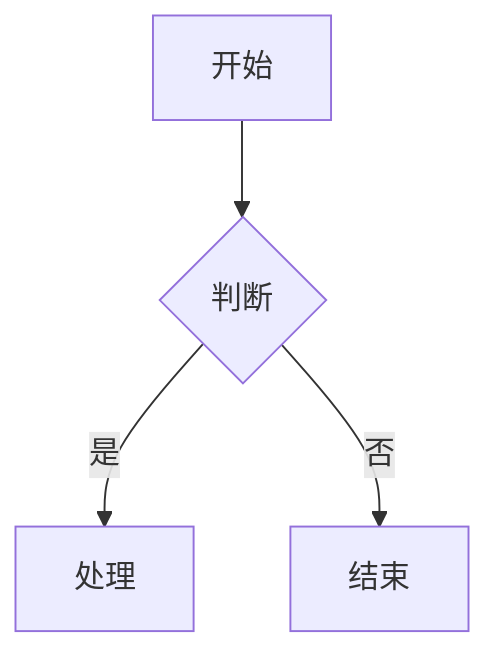
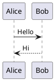

# Markdown 使用教程

本文全面介绍本博客支持的 **Markdown** 语法。掌握这些语法，你就可以写出格式美观、结构清晰的技术文章。

---

## 一、基础语法

### 1. 标题

使用 `#` 符号表示标题，`#` 数量越多级别越低：

```markdown
# 一级标题
## 二级标题
### 三级标题
#### 四级标题
##### 五级标题
###### 六级标题
```

效果：

# 一级标题
## 二级标题
### 三级标题
#### 四级标题
##### 五级标题
###### 六级标题

---

### 2. 段落与换行

直接输入文字即可形成段落。段落之间需要空一行：

```markdown
这是第一个段落。

这是第二个段落，与第一个段落之间空了一行。
```

效果：

这是第一个段落。

这是第二个段落，与第一个段落之间空了一行。

---

### 3. 粗体与斜体

```markdown
**粗体文字**
*斜体文字*
***粗斜体文字***
~~删除线文字~~
```

效果：

**粗体文字**
*斜体文字*
***粗斜体文字***
~~删除线文字~~

---

### 4. 引用

使用 `>` 符号创建引用块：

```markdown
> 这是一段引用文字。
> 可以有多行。
>
> > 这是嵌套引用。
```

效果：

> 这是一段引用文字。
> 可以有多行。
>
> > 这是嵌套引用。

---

### 5. 列表

#### 无序列表

```markdown
- 苹果
- 香蕉
- 橙子
  - 脐橙
  - 血橙
```

效果：

- 苹果
- 香蕉
- 橙子
  - 脐橙
  - 血橙

#### 有序列表

```markdown
1. 第一步：安装 Node.js
2. 第二步：初始化项目
3. 第三步：安装依赖
   1. 安装开发依赖
   2. 安装生产依赖
```

效果：

1. 第一步：安装 Node.js
2. 第二步：初始化项目
3. 第三步：安装依赖
   1. 安装开发依赖
   2. 安装生产依赖

#### 任务列表

```markdown
- [x] 已完成：搭建博客框架
- [x] 已完成：配置主题系统
- [ ] 待完成：添加评论功能
- [ ] 待完成：SEO 优化
```

效果：

- [x] 已完成：搭建博客框架
- [x] 已完成：配置主题系统
- [ ] 待完成：添加评论功能
- [ ] 待完成：SEO 优化

---

### 6. 链接与图片

#### 链接

```markdown
[星觅海的博客](https://mdui.xmhai.cn)
[GitHub](https://github.com/xingmihai "我的 GitHub 主页")
```

效果：

[星觅海的博客](https://mdui.xmhai.cn)
[GitHub](https://github.com/xingmihai "我的 GitHub 主页")

#### 图片

```markdown

```

效果：


> **提示**：点击文章中的图片可以放大查看（支持灯箱效果）。

---

### 7. 分割线

使用三个或以上的 `-`、`*` 或 `_`：

```markdown
---

***

___
```

效果：

---

***

___

---

### 8. 代码

#### 行内代码

使用反引号 `` ` `` 包裹：

```markdown
使用 `npm install` 安装依赖。
```

效果：

使用 `npm install` 安装依赖。

#### 代码块

使用三个反引号包裹，并指定语言以获得语法高亮：

````markdown
```javascript
function greet(name) {
  console.log(`Hello, ${name}!`);
}

greet('World');
```
````

效果：

```javascript
function greet(name) {
  console.log(`Hello, ${name}!`);
}

greet('World');
```

> **提示**：代码块右上角有复制按钮，点击即可复制全部代码。

---

### 9. 表格

```markdown
| 功能 | 状态 | 说明 |
|------|------|------|
| 暗色模式 | 已完成 | 支持亮色/暗色/跟随系统 |
| 搜索功能 | 已完成 | 基于 Fuse.js 全文搜索 |
| RSS 订阅 | 已完成 | 自动生成 rss.xml |
| 评论系统 | 已完成 | 基于 Waline |
| PWA 支持 | 计划中 | 离线访问 |
```

效果：

| 功能 | 状态 | 说明 |
|------|------|------|
| 暗色模式 | 已完成 | 支持亮色/暗色/跟随系统 |
| 搜索功能 | 已完成 | 基于 Fuse.js 全文搜索 |
| RSS 订阅 | 已完成 | 自动生成 rss.xml |
| 评论系统 | 已完成 | 基于 Waline |
| PWA 支持 | 计划中 | 离线访问 |

---

### 10. 脚注

```markdown
Markdown 是一种轻量级标记语言[^1]，由 John Gruber 创建[^2]。

[^1]: https://daringfireball.net/projects/markdown/
[^2]: John Gruber 于 2004 年创建了 Markdown。
```

效果：

Markdown 是一种轻量级标记语言[^1]，由 John Gruber 创建[^2]。

[^1]: https://daringfireball.net/projects/markdown/
[^2]: John Gruber 于 2004 年创建了 Markdown。

---

## 二、扩展语法 (GFM)

本博客使用 **GitHub Flavored Markdown (GFM)**，支持以下扩展语法：

### 自动链接

直接输入 URL 即可自动转换为链接：

```markdown
https://mdui.xmhai.cn
```

效果：

https://mdui.xmhai.cn

---

### 表情符号

```markdown
:smile: :rocket: :star: :fire: :heart:
```

效果：

:smile: :rocket: :star: :fire: :heart:

---

## 三、图表支持

### 1. Mermaid 图表

使用 ` ```mermaid ` 代码块插入 Mermaid 图表：

````markdown

````

效果：


支持的图表类型包括：流程图、时序图、类图、状态图、ER 图、甘特图、饼图、Git 分支图、思维导图、象限图等。

> **提示**：图表支持暗色/亮色主题自动切换。

---

### 2. PlantUML 图表

使用 ` ```plantuml ` 代码块插入 PlantUML 图表：

````markdown

````

效果：


支持的图表类型包括：时序图、用例图、类图、活动图、组件图、状态图、部署图、甘特图、思维导图等。

> **提示**：PlantUML 图表通过在线服务器渲染，首次加载可能需要几秒钟。

---

## 四、Front Matter

每篇文章开头需要包含 Front Matter 元数据：

```markdown
---
title: 文章标题
date: 2026-07-20
tags: ["标签1", "标签2"]
description: 文章摘要描述
cover: https://example.com/cover.jpg
---
```

| 字段 | 必填 | 说明 |
|------|------|------|
| `title` | 是 | 文章标题 |
| `date` | 是 | 发布日期，格式 `YYYY-MM-DD` |
| `tags` | 否 | 标签数组，用于分类和搜索 |
| `description` | 否 | 文章摘要，显示在列表页和 SEO 中 |
| `cover` | 否 | 封面图片 URL |

---

## 五、写作建议

### 1. 文章结构

建议采用以下结构组织文章：

```markdown
# 文章标题

## 引言

简要介绍文章主题和背景。

## 正文

### 第一部分

详细内容...

### 第二部分

详细内容...

## 总结

回顾要点，给出结论或建议。
```

### 2. 代码规范

- 代码块务必指定语言，以获得正确的语法高亮
- 关键代码添加注释说明
- 较长的代码块建议配合文字解释

### 3. 图片使用

- 使用高清图片（建议宽度 ≥ 1200px）
- 为图片添加描述性的 alt 文本
- 控制图片数量，避免影响加载速度

### 4. 链接规范

- 外部链接使用完整 URL（包含 `https://`）
- 内部链接使用相对路径
- 为链接添加 title 属性，提供额外信息

---

## 六、快速参考

### 常用语法速查表

| 语法 | 效果 |
|------|------|
| `# 标题` | 一级标题 |
| `**粗体**` | **粗体** |
| `*斜体*` | *斜体* |
| `` `代码` `` | `代码` |
| `[链接](url)` | [链接](url) |
| `` | 图片 |
| `> 引用` | 引用块 |
| `- 列表项` | 无序列表 |
| `1. 列表项` | 有序列表 |
| `- [x] 任务` | 任务列表 |
| `\| 表格 \|` | 表格 |
| `---` | 分割线 |
| `~~删除线~~` | ~~删除线~~ |

---

## 七、示例文章

以下是一篇完整的示例文章：

```markdown
---
title: 我的第一篇博客文章
date: 2026-07-20
tags: ["随笔", "开始"]
description: 这是我的第一篇博客文章，记录搭建博客的心得
cover: https://images.unsplash.com/photo-1499750310107-5fef28a66643?w=1200
---

# 我的第一篇博客文章

> 千里之行，始于足下。

## 前言

经过几天的折腾，我的博客终于搭建完成了！

## 技术选型

本次搭建使用了以下技术栈：

- **前端框架**：原生 HTML + MDUI v2
- **构建工具**：Node.js
- **部署平台**：Cloudflare Pages
- **评论系统**：Waline

## 核心功能

### 1. 主题切换

支持三种主题模式：

1. 亮色模式
2. 暗色模式
3. 跟随系统

### 2. 搜索功能

基于 Fuse.js 实现的全文搜索，支持：

- 标题搜索
- 内容搜索
- 标签搜索

```javascript
const fuse = new Fuse(posts, {
  keys: ['title', 'content', 'tags'],
  threshold: 0.35
});
```

## 总结

搭建博客的过程虽然遇到了不少问题，但最终都一一解决了。希望这个博客能记录我的成长轨迹。

---

*感谢阅读！欢迎在下方评论区留言交流。*
```

---

## 八、常见问题

### Q1: 为什么我的代码块没有语法高亮？

请确保代码块标记了语言，例如：

````markdown
```javascript  ← 这里指定了语言
const a = 1;
```
````

### Q2: 图片无法显示怎么办？

检查图片 URL 是否可访问。建议使用 HTTPS 链接，并确保图片服务器允许跨域访问。

### Q3: Mermaid 图表渲染失败？

请检查语法是否正确。常见错误包括：
- 缺少 `@startuml` / `@enduml`（PlantUML）
- 使用了不支持的图表类型
- 特殊字符未正确转义

### Q4: 如何添加文章封面？

在 Front Matter 中添加 `cover` 字段：

```markdown
---
cover: https://example.com/image.jpg
---
```

---

现在你已经掌握了本博客支持的所有 Markdown 语法，开始写作吧！
