# Mermaid 图表全展示

本文展示博客目前支持的所有 **Mermaid** 图表类型。只需在 Markdown 中使用 ` ```mermaid ` 代码块，即可自动生成对应的 SVG 图表，且支持亮色/暗色主题自动切换。

---

## 1. 流程图 (Flowchart)

最常用的图表类型，支持多种方向与节点样式。

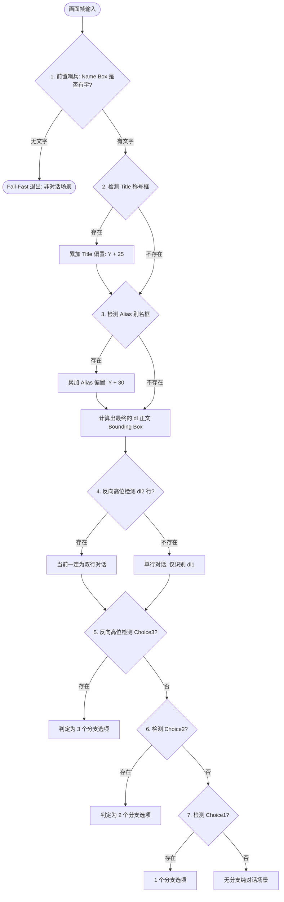
```mermaid
graph TD
    Start([画面帧输入]) --> CheckName{1. 前置哨兵: Name Box 是否有字?}
    CheckName -- 无文字 --> Exit([Fail-Fast 退出: 非对话场景])
    CheckName -- 有文字 --> CheckTitle{2. 检测 Title 称号框}

    CheckTitle -- 存在 --> AddTitleOffset[累加 Title 偏置: Y + 25] --> CheckAlias
    CheckTitle -- 不存在 --> CheckAlias{3. 检测 Alias 别名框}

    CheckAlias -- 存在 --> AddAliasOffset[累加 Alias 偏置: Y + 30] --> ApplyCoords
    CheckAlias -- 不存在 --> ApplyCoords[计算出最终的 dl 正文 Bounding Box]

    ApplyCoords --> CheckDL2{4. 反向高位检测 dl2 行?}
    CheckDL2 -- 存在 --> TwoLines[当前一定为双行对话] --> DetectChoices
    CheckDL2 -- 不存在 --> OneLine[单行对话, 仅识别 dl1] --> DetectChoices

    DetectChoices{5. 反向高位检测 Choice3?}
    DetectChoices -- 存在 --> C3[判定为 3 个分支选项]
    DetectChoices -- 否 --> CheckC2{6. 检测 Choice2?}
    CheckC2 -- 存在 --> C2[判定为 2 个分支选项]
    CheckC2 -- 否 --> CheckC1{7. 检测 Choice1?}
    CheckC1 -- 存在 --> C1[1 个分支选项]
    CheckC1 -- 否 --> C0[无分支纯对话场景]
```

---

## 2. 时序图 (Sequence Diagram)

展示系统或对象之间的交互顺序。

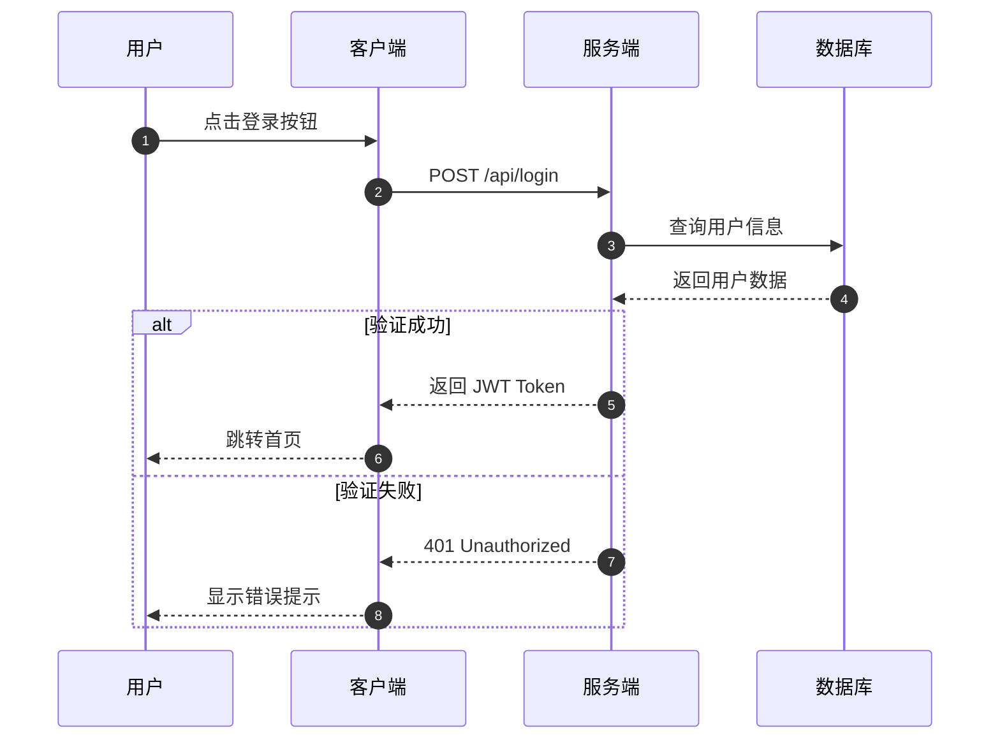
```mermaid
sequenceDiagram
    autonumber
    participant U as 用户
    participant C as 客户端
    participant S as 服务端
    participant DB as 数据库

    U->>C: 点击登录按钮
    C->>S: POST /api/login
    S->>DB: 查询用户信息
    DB-->>S: 返回用户数据
    alt 验证成功
        S-->>C: 返回 JWT Token
        C-->>U: 跳转首页
    else 验证失败
        S-->>C: 401 Unauthorized
        C-->>U: 显示错误提示
    end
```

---

## 3. 类图 (Class Diagram)

描述面向对象系统的类结构与关系。

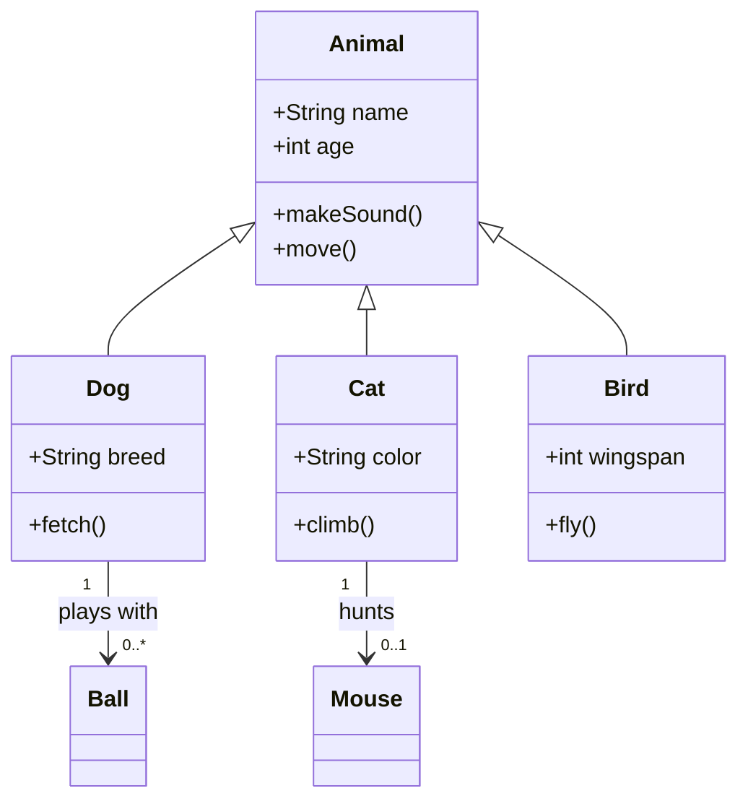
```mermaid
classDiagram
    class Animal {
        +String name
        +int age
        +makeSound()
        +move()
    }
    class Dog {
        +String breed
        +fetch()
    }
    class Cat {
        +String color
        +climb()
    }
    class Bird {
        +int wingspan
        +fly()
    }

    Animal <|-- Dog
    Animal <|-- Cat
    Animal <|-- Bird

    Dog "1" --> "0..*" Ball : plays with
    Cat "1" --> "0..1" Mouse : hunts
```

---

## 4. 状态图 (State Diagram)

展示对象在其生命周期中的状态转换。

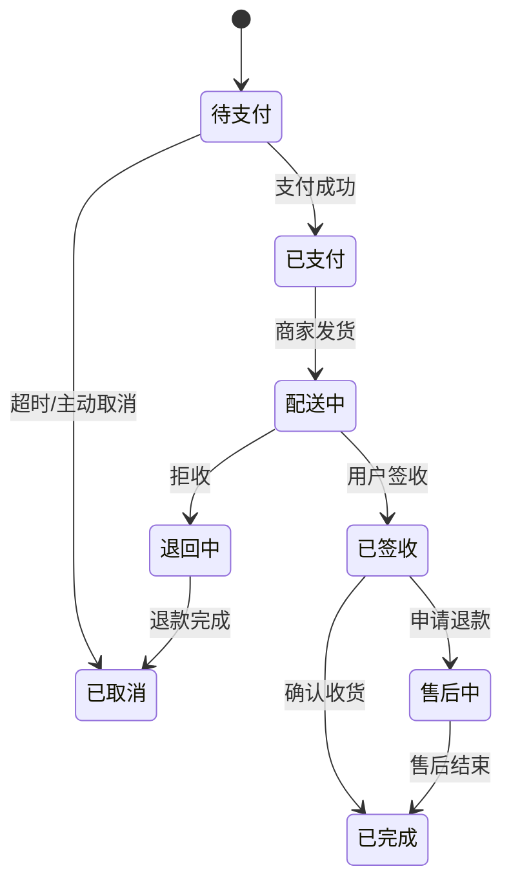
```mermaid
stateDiagram-v2
    [*] --> 待支付
    待支付 --> 已支付: 支付成功
    待支付 --> 已取消: 超时/主动取消
    已支付 --> 配送中: 商家发货
    配送中 --> 已签收: 用户签收
    配送中 --> 退回中: 拒收
    已签收 --> 已完成: 确认收货
    已签收 --> 售后中: 申请退款
    退回中 --> 已取消: 退款完成
    售后中 --> 已完成: 售后结束
```

---

## 5. ER 图 (Entity Relationship)

数据库实体关系图。

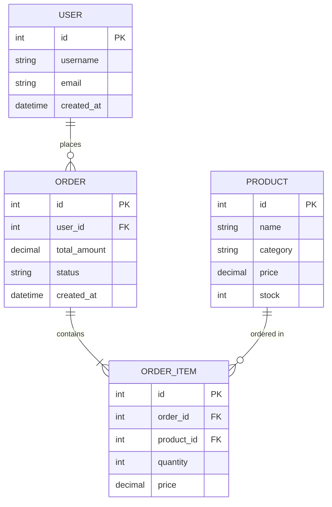
```mermaid
erDiagram
    USER ||--o{ ORDER : places
    USER {
        int id PK
        string username
        string email
        datetime created_at
    }
    ORDER ||--|{ ORDER_ITEM : contains
    ORDER {
        int id PK
        int user_id FK
        decimal total_amount
        string status
        datetime created_at
    }
    ORDER_ITEM {
        int id PK
        int order_id FK
        int product_id FK
        int quantity
        decimal price
    }
    PRODUCT ||--o{ ORDER_ITEM : "ordered in"
    PRODUCT {
        int id PK
        string name
        string category
        decimal price
        int stock
    }
```

---

## 6. 用户旅程图 (User Journey)

展示用户完成任务的体验流程。

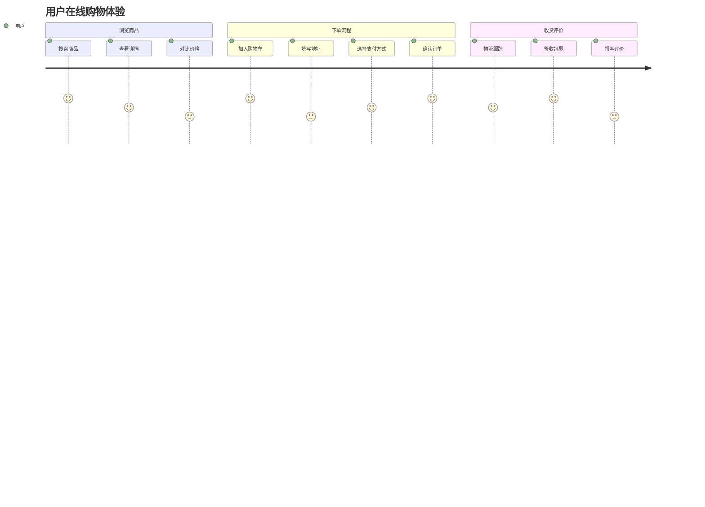
```mermaid
journey
    title 用户在线购物体验
    section 浏览商品
      搜索商品: 5: 用户
      查看详情: 4: 用户
      对比价格: 3: 用户
    section 下单流程
      加入购物车: 5: 用户
      填写地址: 3: 用户
      选择支付方式: 4: 用户
      确认订单: 5: 用户
    section 收货评价
      物流跟踪: 4: 用户
      签收包裹: 5: 用户
      撰写评价: 3: 用户
```

---

## 7. 甘特图 (Gantt)

项目进度管理。

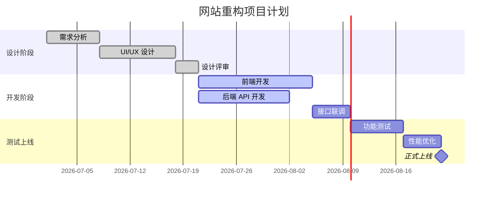
```mermaid
gantt
    title 网站重构项目计划
    dateFormat  YYYY-MM-DD
    section 设计阶段
    需求分析           :done, a1, 2026-07-01, 7d
    UI/UX 设计         :done, a2, after a1, 10d
    设计评审           :done, a3, after a2, 3d
    section 开发阶段
    前端开发           :active, b1, after a3, 15d
    后端 API 开发       :active, b2, after a3, 12d
    接口联调           :b3, after b1, 5d
    section 测试上线
    功能测试           :c1, after b3, 7d
    性能优化           :c2, after c1, 5d
    正式上线           :milestone, c3, after c2, 0d
```

---

## 8. 饼图 (Pie Chart)

数据占比可视化。

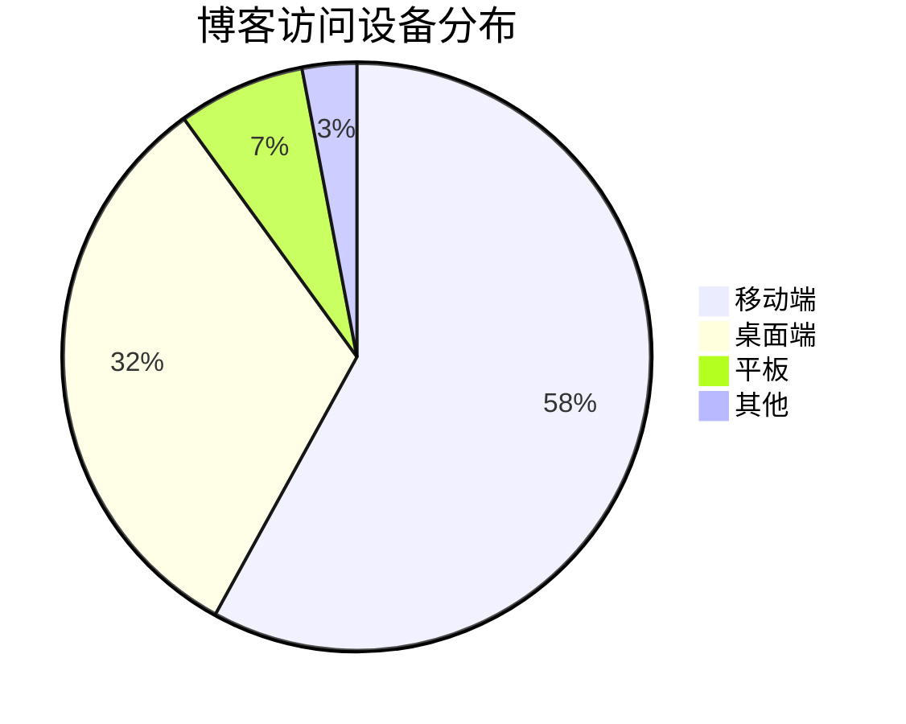
```mermaid
pie title 博客访问设备分布
    "移动端" : 58
    "桌面端" : 32
    "平板" : 7
    "其他" : 3
```

---

## 9. Git 分支图 (Git Graph)

展示 Git 分支与提交历史。

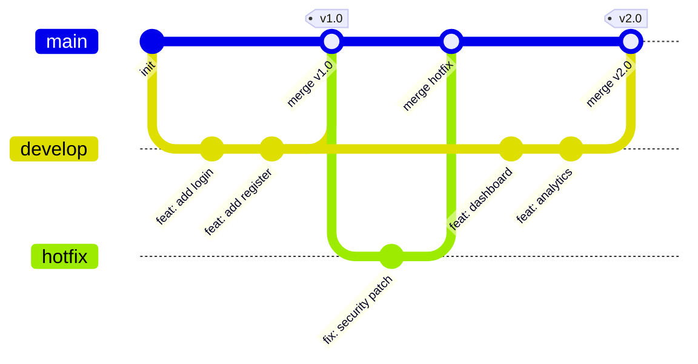
```mermaid
gitGraph
    commit id: "init"
    branch develop
    checkout develop
    commit id: "feat: add login"
    commit id: "feat: add register"
    checkout main
    merge develop id: "merge v1.0" tag: "v1.0"
    branch hotfix
    checkout hotfix
    commit id: "fix: security patch"
    checkout main
    merge hotfix id: "merge hotfix"
    checkout develop
    commit id: "feat: dashboard"
    commit id: "feat: analytics"
    checkout main
    merge develop id: "merge v2.0" tag: "v2.0"
```

---

## 10. 思维导图 (Mindmap)

层级结构的知识梳理。

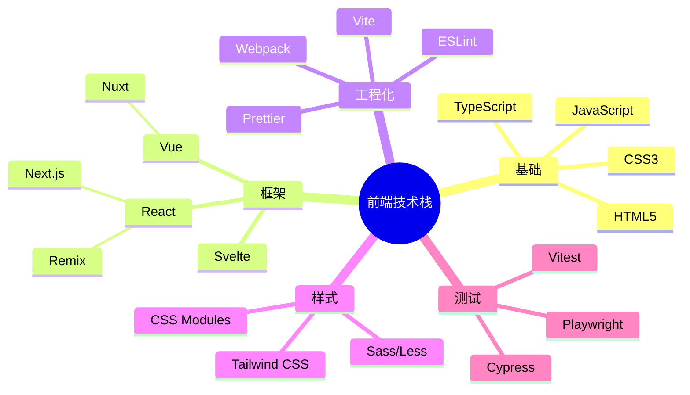
```mermaid
mindmap
  root((前端技术栈))
    基础
      HTML5
      CSS3
      JavaScript
      TypeScript
    框架
      React
        Next.js
        Remix
      Vue
        Nuxt
      Svelte
    工程化
      Vite
      Webpack
      ESLint
      Prettier
    样式
      Tailwind CSS
      Sass/Less
      CSS Modules
    测试
      Vitest
      Playwright
      Cypress
```

---

## 11. 时间线图 (Timeline)

按时间顺序展示事件。

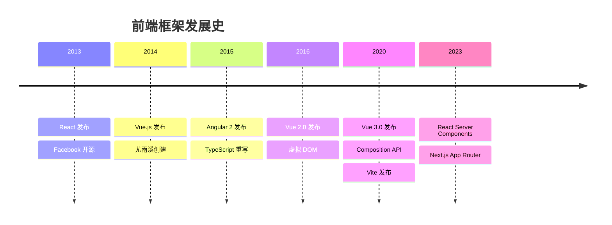
```mermaid
timeline
    title 前端框架发展史
    2013 : React 发布
         : Facebook 开源
    2014 : Vue.js 发布
         : 尤雨溪创建
    2015 : Angular 2 发布
         : TypeScript 重写
    2016 : Vue 2.0 发布
         : 虚拟 DOM
    2020 : Vue 3.0 发布
         : Composition API
         : Vite 发布
    2023 : React Server Components
         : Next.js App Router
```

---

## 12. 象限图 (Quadrant Chart)

四象限分析。

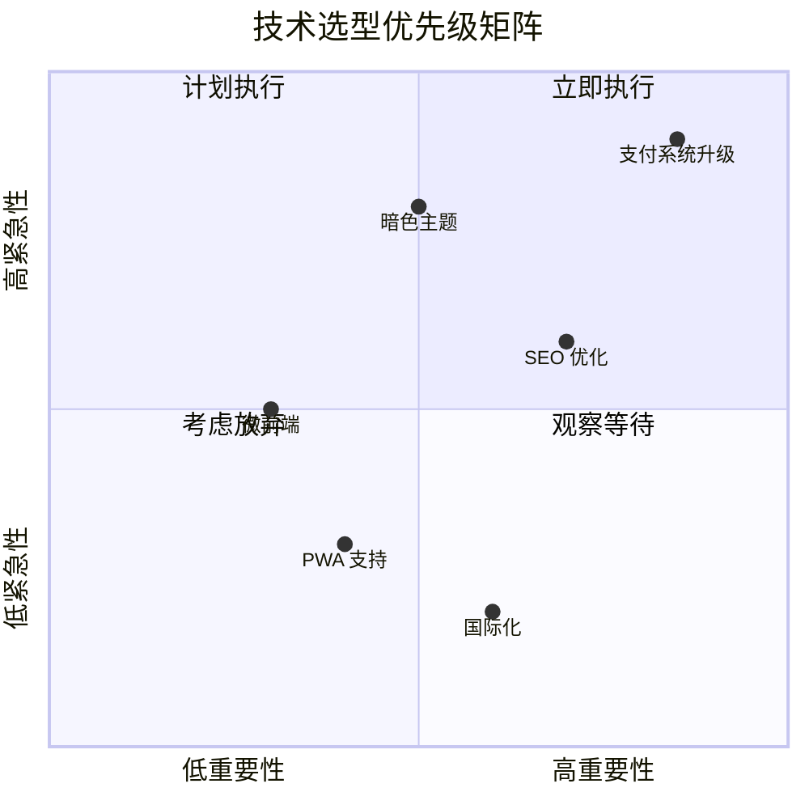
```mermaid
quadrantChart
    title 技术选型优先级矩阵
    x-axis 低重要性 --> 高重要性
    y-axis 低紧急性 --> 高紧急性
    quadrant-1 立即执行
    quadrant-2 计划执行
    quadrant-3 考虑放弃
    quadrant-4 观察等待
    "支付系统升级": [0.85, 0.9]
    "SEO 优化": [0.7, 0.6]
    "暗色主题": [0.5, 0.8]
    "PWA 支持": [0.4, 0.3]
    "国际化": [0.6, 0.2]
    "微前端": [0.3, 0.5]
```

---

## 13. 桑基图 (Sankey Diagram)

流量/能量流向可视化。注意桑基图节点名避免使用特殊字符。

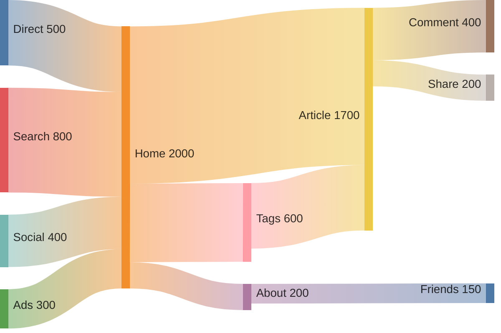
```mermaid
sankey-beta
    Direct,Home,500
    Search,Home,800
    Social,Home,400
    Ads,Home,300
    Home,Article,1200
    Home,About,200
    Home,Tags,600
    Article,Comment,400
    Article,Share,200
    Tags,Article,500
    About,Friends,150
```

---

## 14. XY 图表 (XY Chart)

简单的数据图表。

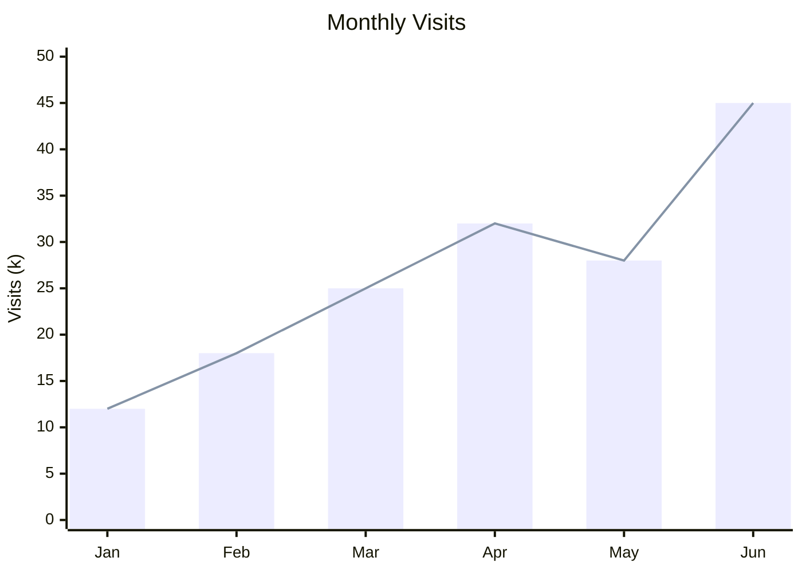
```mermaid
xychart-beta
    title "Monthly Visits"
    x-axis [Jan, Feb, Mar, Apr, May, Jun]
    y-axis "Visits (k)" 0 --> 50
    bar [12, 18, 25, 32, 28, 45]
    line [12, 18, 25, 32, 28, 45]
```

---

## 15. 块图 (Block Diagram)

系统模块关系图。

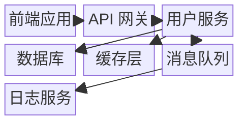
```mermaid
block-beta
    columns 3
    A["前端应用"] B["API 网关"] C["用户服务"]
    D["数据库"] E["缓存层"] F["消息队列"]
    G["日志服务"]
    A --> B
    B --> C
    C --> D
    C --> E
    C --> F
    F --> G
```

---

## 16. 看板 (Kanban)

敏捷开发任务看板。

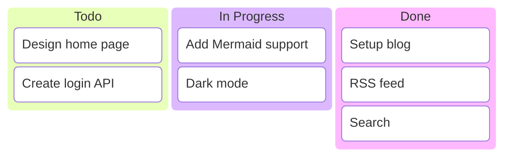
```mermaid
kanban
    [Todo]
        [Design home page]
        [Create login API]
    [In Progress]
        [Add Mermaid support]
        [Dark mode]
    [Done]
        [Setup blog]
        [RSS feed]
        [Search]
```

---

## 17. 需求图 (Requirement Diagram)

系统需求追踪。

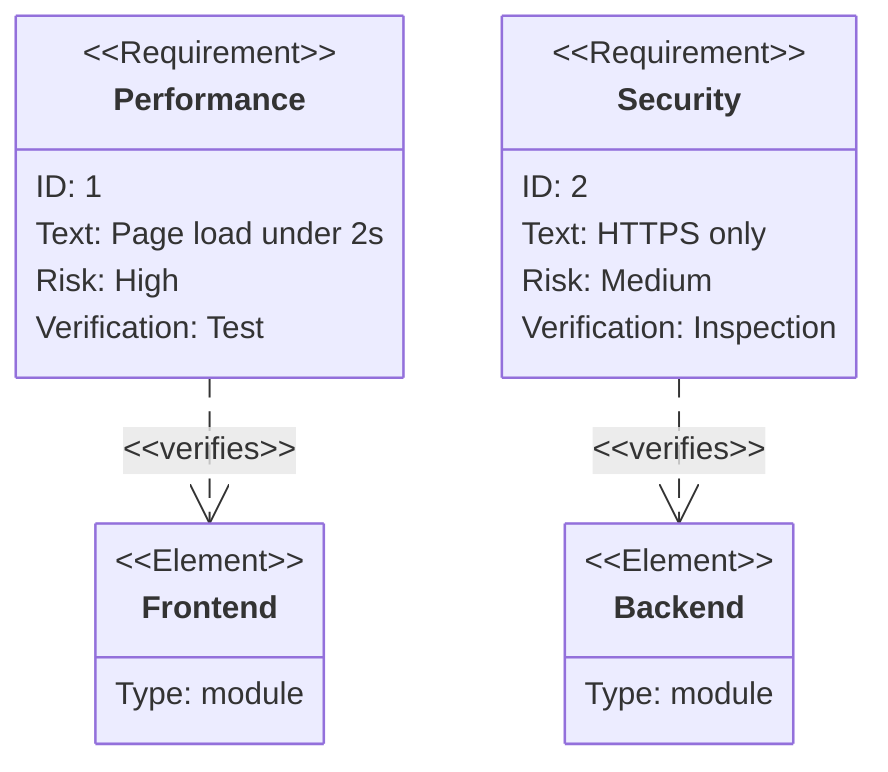
```mermaid
requirementDiagram
    requirement Performance {
        id: 1
        text: Page load under 2s
        risk: high
        verifymethod: test
    }
    requirement Security {
        id: 2
        text: HTTPS only
        risk: medium
        verifymethod: inspection
    }
    element Frontend {
        type: module
    }
    element Backend {
        type: module
    }
    Performance - verifies -> Frontend
    Security - verifies -> Backend
```

---

## 18. 雷达图 (Radar)

多维度能力评估。

```mermaid
radar
    title Tech Stack Radar
    axis Performance, Maintainability, Community, Learning, Ecosystem
    scale 0 --> 10
    React: [9, 8, 10, 6, 10]
    Vue: [8, 9, 9, 9, 9]
    Svelte: [10, 8, 6, 8, 5]
    Angular: [7, 7, 7, 4, 8]
```

---

## 19. C4 架构图 (C4Context)

软件架构上下文图。

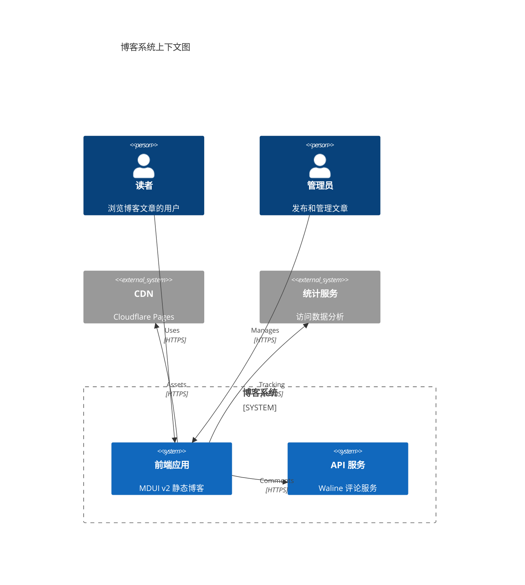
```mermaid
C4Context
    title 博客系统上下文图
    Person(reader, "读者", "浏览博客文章的用户")
    Person(admin, "管理员", "发布和管理文章")

    System_Boundary(blog, "博客系统") {
        System(frontend, "前端应用", "MDUI v2 静态博客")
        System(api, "API 服务", "Waline 评论服务")
    }

    System_Ext(cdn, "CDN", "Cloudflare Pages")
    System_Ext(analytics, "统计服务", "访问数据分析")

    Rel(reader, frontend, "Uses", "HTTPS")
    Rel(admin, frontend, "Manages", "HTTPS")
    Rel(frontend, api, "Comments", "HTTPS")
    Rel(frontend, cdn, "Assets", "HTTPS")
    Rel(frontend, analytics, "Tracking", "HTTPS")
```

---

## 20. 架构图 (Architecture)

Beta 版架构图。标签仅支持字母数字和空格。

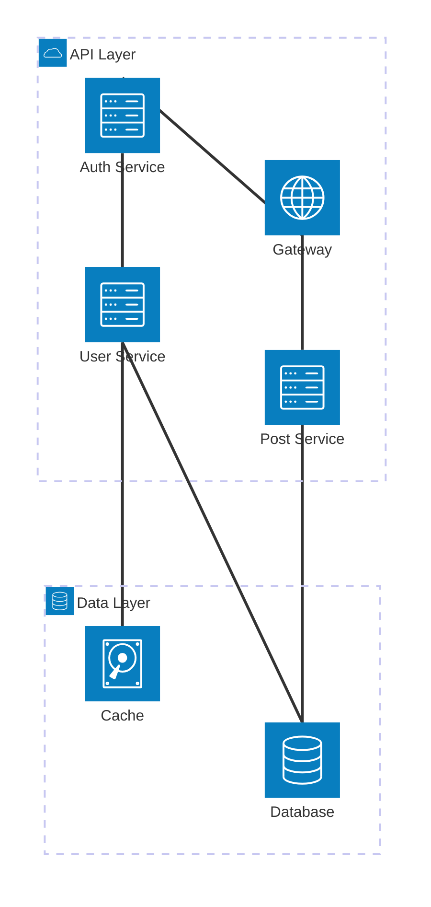
```mermaid
architecture-beta
    group api(cloud)[API Layer]
        service gateway(internet)[Gateway] in api
        service auth(server)[Auth Service] in api
        service user_svc(server)[User Service] in api
        service post_svc(server)[Post Service] in api
    group data(database)[Data Layer]
        service db(database)[Database] in data
        service cache(disk)[Cache] in data

    gateway:B -- T:auth
    auth:B -- T:user_svc
    gateway:B -- T:post_svc
    user_svc:B -- T:db
    post_svc:B -- T:db
    user_svc:B -- T:cache
```

---

## 21. 网络包图 (Packet Diagram)

数据包结构展示。

```mermaid
packet-beta
    title TCP Header Structure
    0-15: "Source Port"
    16-31: "Destination Port"
    32-63: "Sequence Number"
    64-95: "Acknowledgment Number"
    96-99: "Data Offset"
    100-105: "Reserved"
    106: "URG"
    107: "ACK"
    108: "PSH"
    109: "RST"
    110: "SYN"
    111: "FIN"
    112-127: "Window Size"
    128-143: "Checksum"
    144-159: "Urgent Pointer"
    160-191: "Options"
```

---

## 使用方式

在任意 Markdown 文章中，使用以下语法即可插入图表：

````markdown
```mermaid
graph TD
    A[开始] --> B[处理]
    B --> C[结束]
```
````

> **提示**：本博客会自动检测 ` ```mermaid ` 代码块，将其渲染为交互式 SVG 图表，并跟随系统/博客主题自动切换亮暗配色。

> **注意**：部分图表类型（如桑基图、架构图）对特殊字符敏感，建议节点名使用简单字母数字和空格。
