# PlantUML 图表全展示

本文展示博客目前支持的所有 **PlantUML** 图表类型。只需在 Markdown 中使用 ` ```plantuml ` 代码块，即可自动生成对应的图表，通过 PlantUML 在线服务器渲染为 SVG。

---

## 1. 时序图 (Sequence Diagram)

展示对象之间的交互顺序，是 UML 中最常用的图表之一。

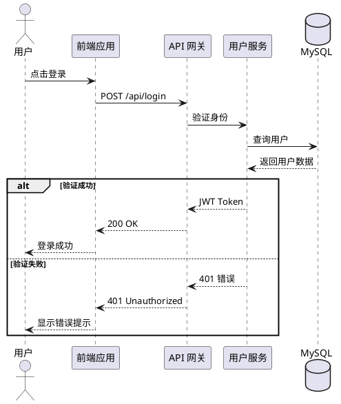

---

## 2. 用例图 (Use Case Diagram)

描述系统功能及与外部参与者的交互。

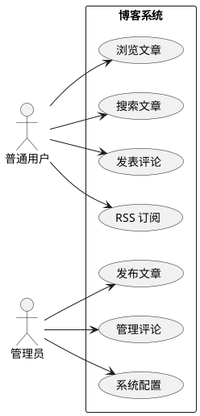

---

## 3. 类图 (Class Diagram)

描述面向对象系统的类结构与关系。

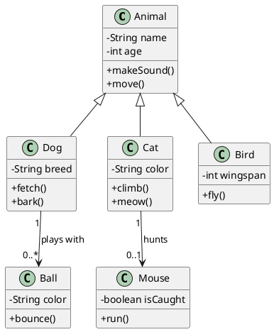

---

## 4. 活动图 (Activity Diagram)

描述业务流程或算法的工作流。

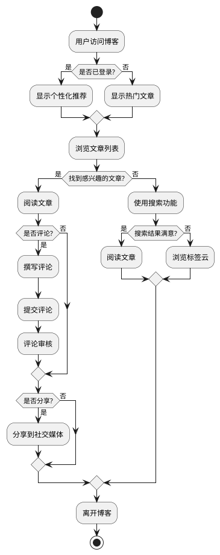

---

## 5. 组件图 (Component Diagram)

展示系统的组件及其依赖关系。

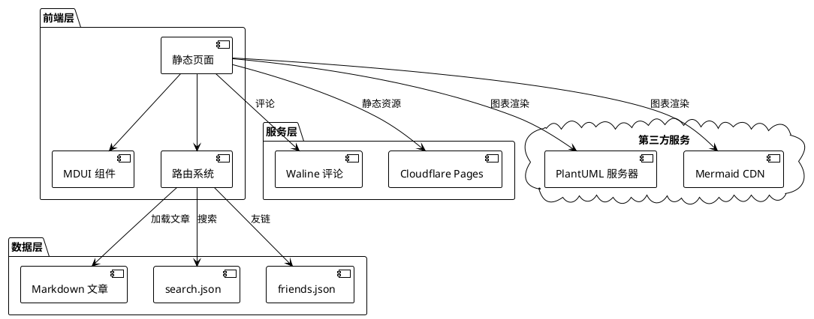

---

## 6. 状态图 (State Diagram)

展示对象在其生命周期中的状态转换。

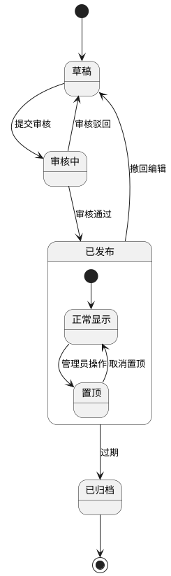

---

## 7. 对象图 (Object Diagram)

展示系统在某一时刻的对象实例及其关系。

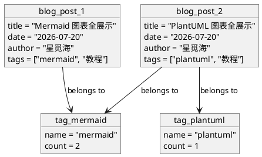

---

## 8. 部署图 (Deployment Diagram)

展示系统的物理部署架构。

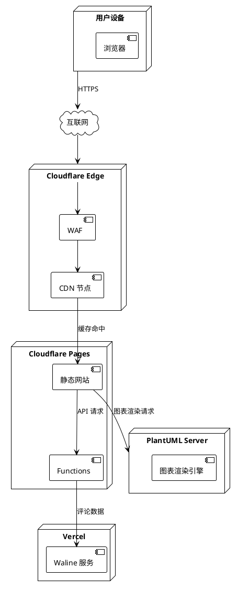

---

## 9. 定时图 (Timing Diagram)

展示对象状态随时间的变化。

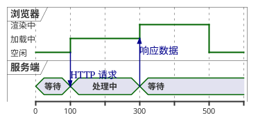

---

## 10. 网络图 (Network Diagram)

展示网络拓扑结构。

```plantuml
@startuml
nwdiag {
    network 外网 {
        互联网
    }
    network 内网 {
        address = "192.168.1.x"
        路由器 [address = "192.168.1.1"]
        交换机 [address = "192.168.1.2"]
        服务器1 [address = "192.168.1.10", description = "Web 服务器"]
        服务器2 [address = "192.168.1.11", description = "数据库服务器"]
        笔记本 [address = "192.168.1.100"]
        手机 [address = "192.168.1.101"]
    }
    互联网 -- 路由器 : 光纤接入
    路由器 -- 交换机 : 千兆网线
    交换机 -- 服务器1 : 网线
    交换机 -- 服务器2 : 网线
    交换机 -- 笔记本 : WiFi
    交换机 -- 手机 : WiFi
}
@enduml
```

---

## 11. 线框图 (Wireframe / Salt)

快速绘制 UI 原型。

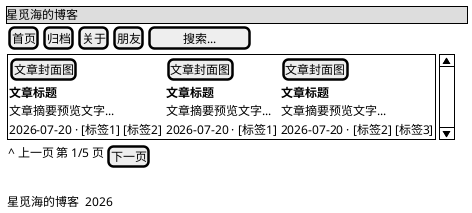

---

## 12. 甘特图 (Gantt Diagram)

项目进度管理。

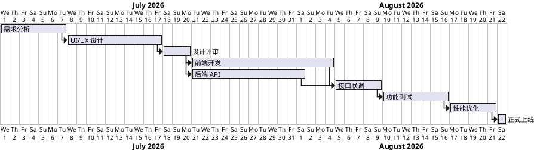

---

## 13. 思维导图 (MindMap)

层级结构的知识梳理。

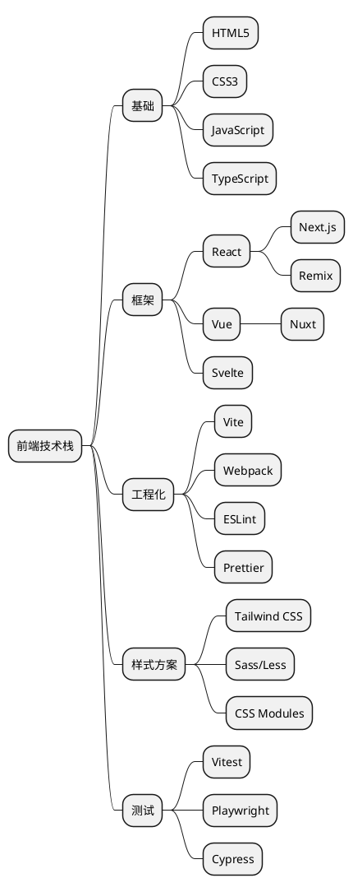

---

## 14. WBS 工作分解结构

项目任务分解。

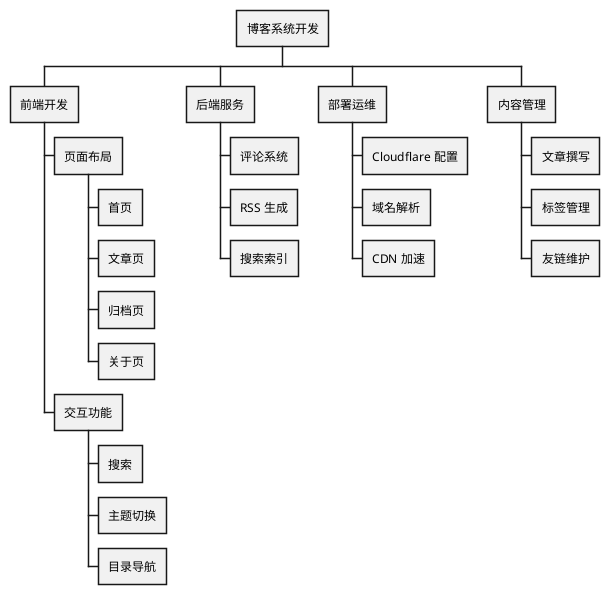

---

## 15. JSON 可视化

将 JSON 数据可视化为图表。

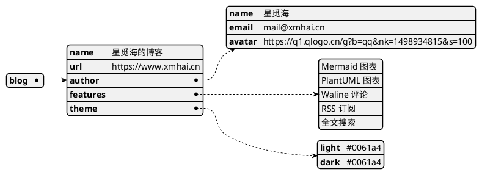

---

## 16. YAML 可视化

将 YAML 数据可视化为图表。

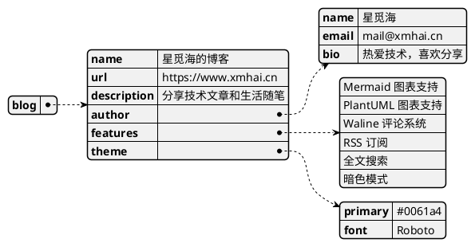

---

## 17. 实体关系图 (ER Diagram)

数据库实体关系。

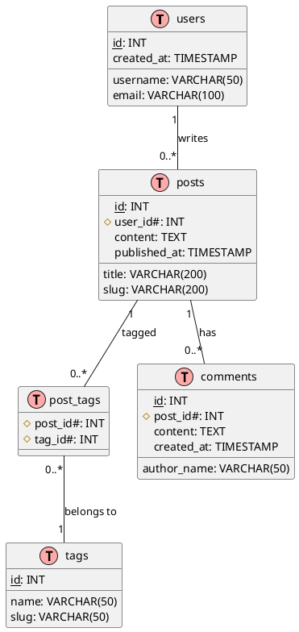

---

## 18. 架构图 (Archimate)

企业架构描述。

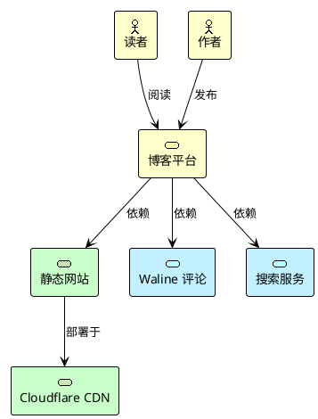

---

## 使用方式

在任意 Markdown 文章中，使用以下语法即可插入 PlantUML 图表：

````markdown
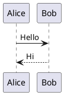
````

> **提示**：本博客会自动检测 ` ```plantuml ` 代码块，通过 PlantUML 在线服务器渲染为 SVG 图片。所有图表支持亮色/暗色主题下的自适应显示。

> **注意**：由于依赖 PlantUML 在线服务器，首次渲染可能需要几秒钟。如果服务器不可用，图表将显示为代码块。
